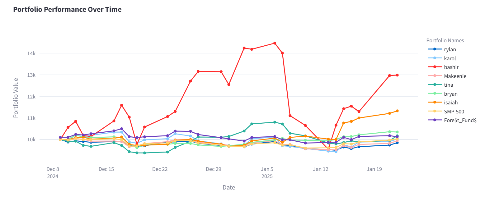
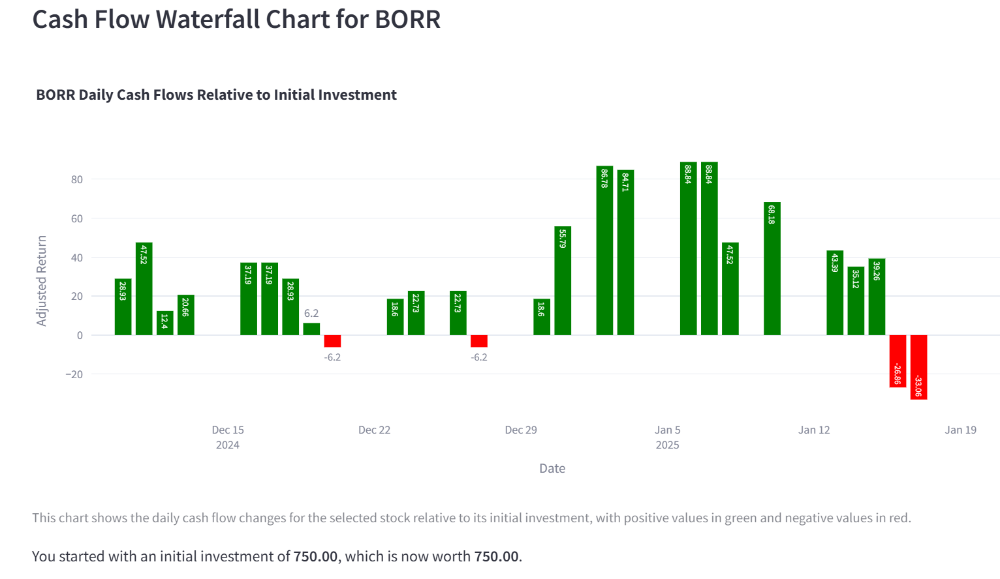
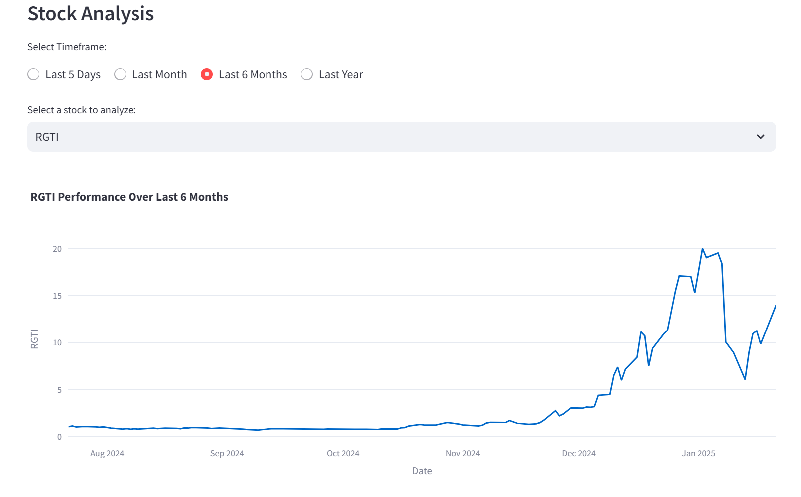

# 💹 Portfolio Simulation Competition

## 📊 **Project Overview**
This project focuses on a portfolio simulation competition where participants built and managed their own stock portfolios. Using Python and Streamlit, I created a dashboard that tracks and visualizes the performance of each portfolio, allowing for in-depth analysis of stock returns, cash flows, and overall portfolio growth.

The dashboard highlights:
- Individual portfolio performance.
- Stock-level analysis for each participant.
- Head-to-head comparison of portfolio growth over time.

The dashboard was designed for easy navigation with tabs for each participant and an overview section comparing all portfolios.

---

## **Key Features**
- **Dynamic Portfolio Performance Tracking**  
  Visualizes how each participant’s portfolio has evolved over time.

- **Cash Flow Waterfall Charts**  
  Shows cash flow changes for each stock relative to its initial investment.

- **Stock-Level Analysis**  
  Enables users to analyze the historical performance of individual stocks.

- **Leaderboard View**  
  Compares all participants' portfolios to see who leads the competition.

---

## **Dashboard Highlights**

### **1️. Portfolio Performance Over Time**
Tracks all participants' portfolios, including benchmark comparisons with the SMP-500 and Fore$t_Fund$ portfolio.



---

### **2️. Cash Flow Waterfall Chart**
Displays cash flow adjustments for individual stocks within each portfolio.



---

### **3️. Stock Analysis**
Allows users to analyze stock performance over different timeframes, enabling detailed investment insights.



---

## 💡 **Technologies Used**
- **Python** for data manipulation
- **Streamlit** for interactive dashboard creation
- **Pandas** for data wrangling
- **Plotly** for advanced data visualizations
- **Excel** for initial data handling and integration

---

## 📁 **Notes**
The dashboard integrates datasets for individual stock prices, portfolio returns, and benchmark indexes. Despite the file structure being slightly complex due to the need for pulling individual stock data, the dashboard provides clear insights into portfolio dynamics.

---

## **Getting Started**
1. **Clone the repository:**
   ```bash
   git clone https://github.com/TinaGrkovic/portfolio_simulation.git
   cd portfolio_simulation
2. **Run the final notebook:**
   ```bash
   streamlit run Jan22_dashboard.py
